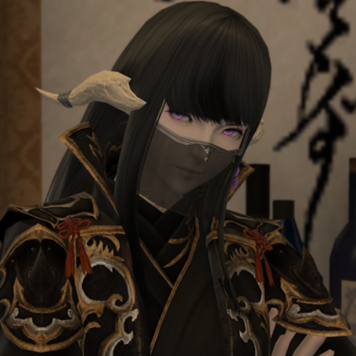

# **卡菈斯·菲奥** {#idx_1}

=== "长弓子虚（第六星历）"
    !!! question "完美大树守卫"
        { align=left width=200 }
        
        

          
        立信为本，以行胜言。来者不拒，往者不追。
          
        

        
 —— 长弓子虚

=== "卡菈斯·菲奥"
    !!! question "完美大树守卫"
        { align=left width=200 }
        
        

          
        立信为本，以行胜言。来者不拒，往者不追。
          
        

        
 —— 长弓子虚

=== "长弓子虚（第七星历）"
    !!! question "完美大树守卫"
        { align=left width=200 }
        
        

          
        立信为本，以行胜言。来者不拒，往者不追。
          
        

        
 —— 长弓子虚

  - 角色名: 长弓子虚
  - 生日: 11月15日
  - 年龄: 22岁
  - 性别: 女
  - 种族: 敖龙 - 晨曦之民
  - 职业: 武士&#8195忍者
  - 喜好: 书&#8195发呆
  - 重要的人: [空一](../VOID/VOID.md)&#8195[八剑云文](#idx_3)

## **人物简介**

&#8195&#8195来自多玛的敖龙少女，似乎有着并不愉快的一段过往。平日里相当沉默，显得相当冷淡，但实际上在相处熟络之后才能发现她热情的一面。 &#8195&#8195总是在避免纷争，却意外地很擅长打架。说话有时候文绉绉的，对于多玛古典文化和历史懂的不少。

## **能力设定**

&#8195&#8195擅用各种冷兵器，尤其是打刀与匕首。各类魔法也略有涉猎，包括简单的咒术、幻术和风水术。在被[巴哈姆特](#idx_2)的力量侵蚀后因祸得福增强了身体的魔法适应性和对以太的感知能力。

## **TA的故事**
### **长弓子虚（第六星历）** {#idx_3}

**第六星历1555年**，长弓家长女出生，附庸风雅的家主长弓风月给孩子取名“子虚”。  
**第六星历1561年**，长弓家主与同为低层贵族的八剑家立下婚约，让长弓子虚未来嫁给八剑家的长子八剑云文。   
**第六星历1565年**，长弓子虚开始在父亲的安排下学习包括风水术和咒术在内的一系列知识和贵族礼仪，被称赞为“完美的大小姐”。  
**第六星历1569年**，加雷马第六军团驻军多玛，王城沦陷，长弓家主夫妇带着全家男丁连夜潜逃，时年14岁的长弓子虚被丢在家中。此后，长弓子虚带着同样被抛下的一众女眷逃出多玛王城，众人意外失散。长弓子虚在几个鲶鱼精族家仆的带领下前往无二江流域的鲶鱼精聚落躲避帝国的追捕。  
**第六星历1571年**，长弓子虚在无二江中捞起来一位流浪忍者，将其接到鲶鱼精聚落中养伤。流浪忍者伤势痊愈后，教给了长弓子虚包含刀术和忍术在内的许多战斗技巧。同年冬季，帝国河畔堡的军队开始出兵清扫附近的蛮族聚落，无名忍者掩护长弓子虚撤离时被帝国士兵格杀。此后长弓子虚混上了前往利姆萨·罗敏萨的船。迎合西洲文化起了新的名字[“卡菈丝·菲奥”](#idx_1)，并最终在黑衣森林一带安定下来。

### **卡菈丝·菲奥** {#idx_2}

在加尔提诺战役前后，卡菈丝·菲奥为维生被迫食用了部分巴哈姆特眷属的血肉。尽管在进食前已经尽可能使以太失活，但来自巴哈姆特的怨念依然造成了不小侵蚀。在路易索瓦对全艾欧泽亚使用苏生之炎后怨念被压制。  
**第六星历1577年，加雷马第十四军团退军，第七灵灾结束，第七星历拉开序幕。**  
**第六星历1576年**，多玛掀起大叛乱，弓束府邸被夷为平地，鲶鱼精们却趁机有了一片居住区，逐渐和长弓子虚重新取得联系。  

**第七星历初年**，卡菈丝·菲奥在艾欧泽亚结识了狛风众人。

### **长弓子虚（第七星历）**

在空一的**“绿色地狱”**影响下，卡菈丝·菲奥一度失去了从第六星历1569年以来的全部记忆，分裂出来自过去的“长弓子虚”人格。在记忆逐渐完整后，双人格合一，起主导的为新产生的“长弓子虚”——不过她并不介意别人继续称自己为“菲奥”。  
卫月碎片在地下逐渐修复着巴哈姆特的身体，来自巴哈姆特的怨念也日渐增强，侵蚀体现在长弓子虚身上表现为角和鳞片莫名变成暮晖之民样的黑色。在巴哈姆特的骚动被平息后，侵蚀已不再起效，但带来的变化并未消失。

