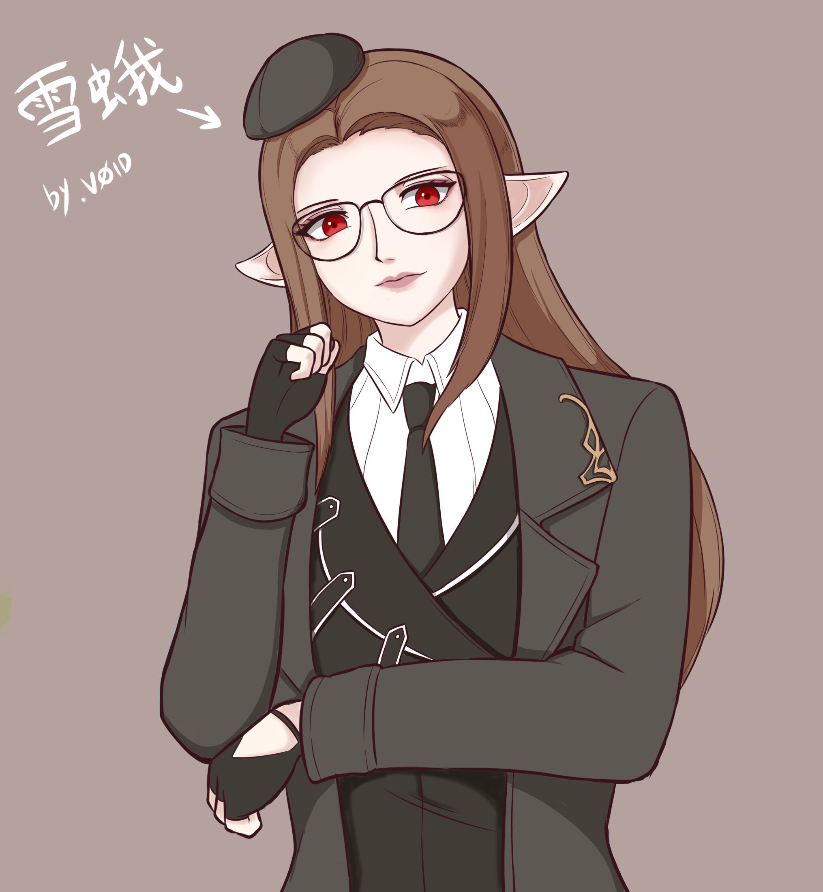
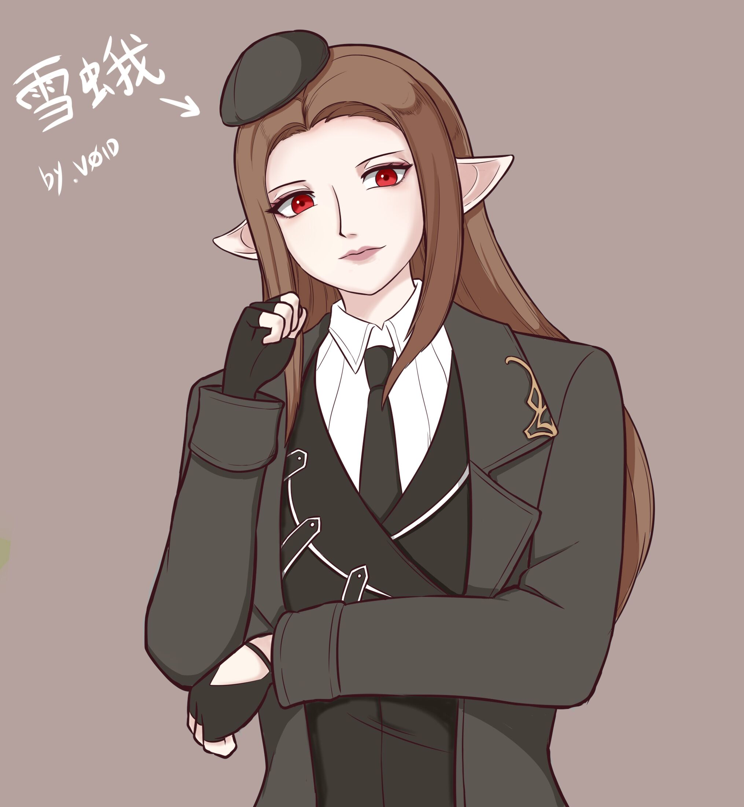

# **雪蛾**

=== "戴眼镜"
    !!! example "雪蛾"
        <figure markdown="span">
            { width=300 }
        </figure>

=== "不戴眼镜"
    !!! example "雪蛾"
        <figure markdown="span">
            { width=300 }
        </figure>
        